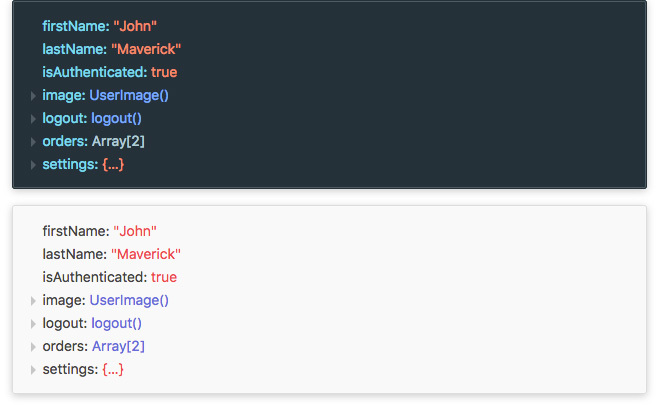

# react-data-preview

Preview any JavaScript data in a fancy interactive way. Heavily inspired by React DevTools props inspector.

<p align="center">
  
</p>

## Getting started
### Install
```bash
npm install react-data-preview
```

### Use
```jsx
import React from 'react';
import Preview from 'react-data-preview';

const data = {
  firstName: 'John',
  lastName: 'Maverick',
  isAuthenticated: true
  image: class Image {},
  logout() {},
  orders: [{}, {}],
  settings: {
    nestedKey: 'foo'
  }
};

export default class App extends React.Component {
  render() {
    return (
      <Preview data={ data } />
    );
  }
}
```

## License
MIT
